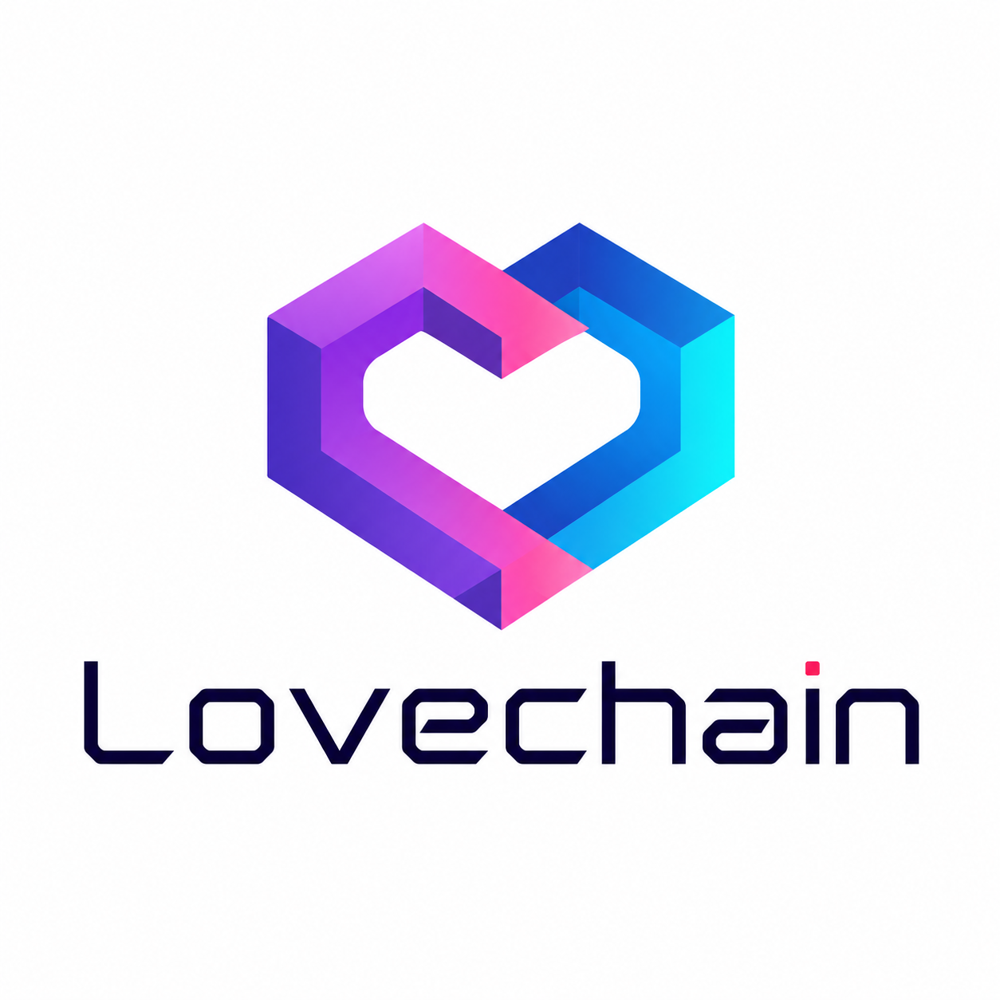

# LoveChain

**Blockchain for lovers.**

LoveChain — это цифровой блокчейн любви, доверия и совместной жизни пары.

Это не приложение про деньги, сделки, контроль или публичный статус. LoveChain сохраняет живые доказательства того, что два человека выбирают друг друга каждый день: заботу, прогулки, путешествия, примирения, интимность, фотографии, семейные моменты и внимание.

Идея эмоционально близка к ощущению песни для влюблённых: ещё одна песня для двоих, которые ждут любви, движутся навстречу друг другу и не хотят выходить из этого сна. LoveChain превращает это чувство в личную цепочку общих моментов.



## Песня LoveChain

```text
Blockchain for lovers tonight,
write our hearts in a chain of light.
Every step, every touch, every sign,
becomes a block that says you are mine.

No public feed, no jealous score,
just one shared world behind one door.
If we are close, if we move as one,
LoveChain remembers what love has done.

Play one more for the lovers tonight,
for the hands that return, for the eyes that shine.
We do not mine for silver or gold,
we mine the moments we want to hold.
```

## Структура платформ

```text
ANDROID/
    Android-приложение на Kotlin и Jetpack Compose.

IOS/
    Будущая рабочая область iPhone-приложения.

TinyGO/
    Будущая прошивка и низкоуровневая логика для умных колец.
```

Android — первая рабочая платформа. iOS и TinyGO заранее вынесены в отдельные папки, чтобы код разных платформ не смешивался.

## Версия 0.2

Текущая Android-версия содержит:

* локальные модели LoveBlock;
* SHA-256 хеши блоков;
* создание Genesis Block;
* LoveCoins;
* локальное хранение в SQLite;
* подписи устройства через Android Keystore;
* статусы подтверждения подписанных и совместно подтверждённых блоков;
* экспорт и импорт JSON;
* миграцию из первого SharedPreferences JSON-хранилища;
* русские и английские ресурсы интерфейса;
* Jetpack Compose UI;
* ручные блоки Together, Walk, Travel и Gratitude;
* LoveMap foreground service;
* геолокацию при включённом режиме LoveMap;
* BLE advertise + scan для подтверждения близости;
* локальную запись LoveMap snapshots;
* HTTP sync stub с настраиваемым endpoint;
* заглушки для motion detection и event mining.

В приложении нет рекламы, публичной социальной ленты, негативного скоринга и механик ревности.

## Архитектура

```text
ANDROID/app/src/main/java/lovechain/core/
    LoveModels.kt
    LoveBlockHasher.kt
    LoveBlockSignatureVerifier.kt
    LoveChain.kt
    LoveEventServices.kt

ANDROID/app/src/main/java/lovechain/android/
    MainActivity.kt
    DeviceKeyStore.kt
    LoveBlockSQLiteStore.kt
    LoveChainJsonCodec.kt
```

Пакет `core` содержит переносимую логику цепочки отношений. Пакет `android` содержит интерфейс, подпись устройства, SQLite-хранилище, JSON-перенос и миграцию первой версии.

## Будущие версии

```text
0.3 LoveMap Server
    регистрация пары
    местоположение партнёра
    батарея и статус движения
    Go stdlib relay

0.4 Presence
    Near Block
    Together Block
    кандидат блока из BLE + GPS

0.5 Event Mining
    определение прогулки
    определение путешествия
    определение возвращения домой
    кандидаты блоков, подтверждаемые обоими партнёрами
```

## Сборка

Откройте `ANDROID/` в Android Studio и запустите модуль `app`.

Проект остаётся local-first. LoveMap запускается только явно из интерфейса, показывает foreground notification, пишет snapshots локально и отправляет их на sync endpoint только если endpoint задан.
